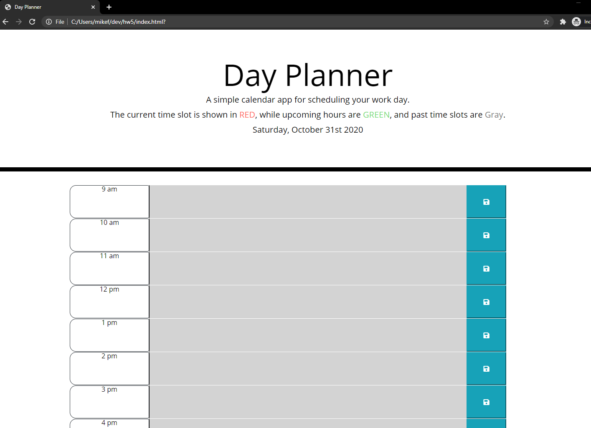
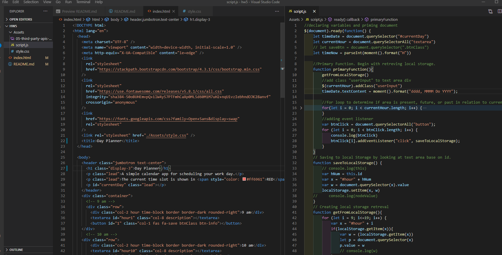

# 05 Third-Party APIs: Day Planner

## Notes:

I went about this by first creating the base html skeleton and deciding on how I wanted to have the text inputed & outputed. I ended up using textarea though I was initially drawn to using form.

Steps & Issues along the way:

- Defined variables and set time format to 24 clock with moment "H" so that I could use the hours to count up and not worry about converting am/pm.

- The primaryFunction was set up to pull from local storage first and then pull the time.

- It will then check to see which divs are current, in the past. or in the future. Apply appropate class so styles can be applied.

- Event listener is added to save to local storage on button clicks & saveToLocalStorage was set up.

- Retreving local storage was set up so that it use a for loop to go through the known time slots and display the stored value if it was found.

- I ran into formatting issues where VS Code's auto complete made my .value a .nodeValue for saveToLocalStorage and that screwed with me for a while before I caught the error.

- I also ran into a problem with my browser caching errors while I was debugging and I needed to switch to an incognito window to make sure my code was working properly.

## Screen Shots:





## Original Task

Create a simple calendar application that allows a user to save events for each hour of the day by modifying starter code. This app will run in the browser and feature dynamically updated HTML and CSS powered by jQuery.

You'll need to use the [Moment.js](https://momentjs.com/) library to work with date and time. Be sure to read the documentation carefully and concentrate on using Moment.js in the browser.

## User Story

```
AS AN employee with a busy schedule
I WANT to add important events to a daily planner
SO THAT I can manage my time effectively
```

## Acceptance Criteria

```
GIVEN I am using a daily planner to create a schedule
WHEN I open the planner
THEN the current day is displayed at the top of the calendar
WHEN I scroll down
THEN I am presented with time blocks for standard business hours
WHEN I view the time blocks for that day
THEN each time block is color-coded to indicate whether it is in the past, present, or future
WHEN I click into a time block
THEN I can enter an event
WHEN I click the save button for that time block
THEN the text for that event is saved in local storage
WHEN I refresh the page
THEN the saved events persist
```

## Mock-Up

The following animation demonstrates the application functionality:


## Grading Requirements

This homework is graded based on the following criteria:

### Technical Acceptance Criteria: 40%

- Satisfies all of the above acceptance criteria plus the following:

  - Uses the Moment.js library to work with date and time

### Deployment: 32%

- Application deployed at live URL

- Application loads with no errors

- Application GitHub URL submitted

- GitHub repo contains application code

### Application Quality: 15%

- Application user experience is intuitive and easy to navigate

- Application user interface style is clean and polished

- Application resembles the mock-up functionality provided in the homework instructions

### Repository Quality: 13%

- Repository has a unique name

- Repository follows best practices for file structure and naming conventions

- Repository follows best practices for class/id naming conventions, indentation, quality comments, etc.

- Repository contains multiple descriptive commit messages

- Repository contains quality README file with description, screenshot, and link to deployed application

## Review

You are required to submit BOTH of the following for review:

- The URL of the functional, deployed application.

- The URL of the GitHub repository. Give the repository a unique name and include a README describing the project.

---

© 2020 Trilogy Education Services, a 2U, Inc. brand. All Rights Reserved.
